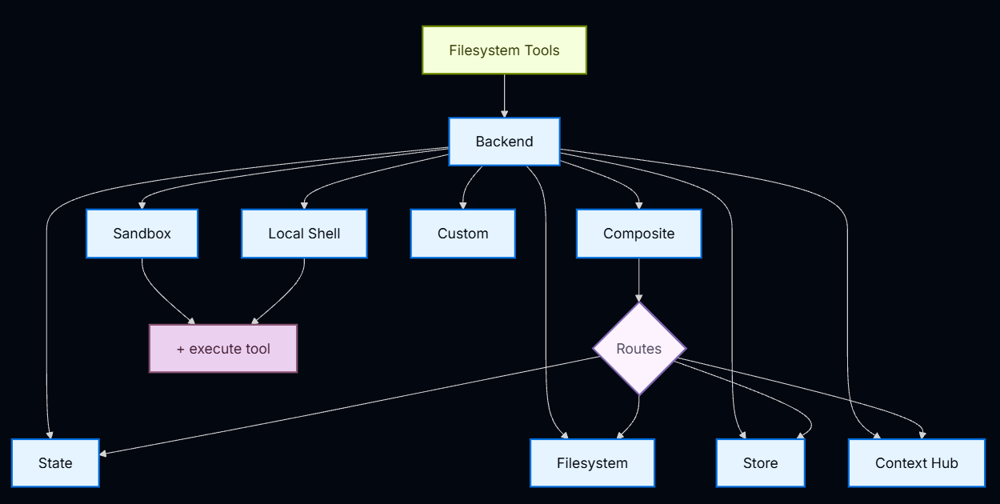
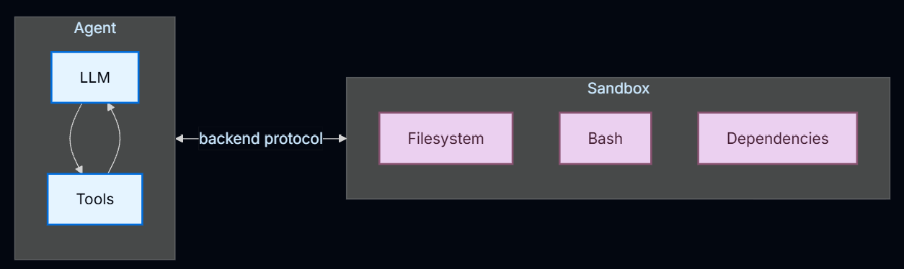

[랭체인아카데미](https://academy.langchain.com/)에서 배운 것을 정리합니다.

최신 버전과 차이가 있으며 아래 작성된 코드는 변경 되었을 수 있습니다.

# 딥에이전트


1. 실행환경

[Tools](https://docs.langchain.com/oss/python/deepagents/tools): 도구나 MCP 정의
```Python
from deepagents import create_deep_agent

agent = create_deep_agent(
    model="anthropic:claude-sonnet-4-6",
    tools=[search, fetch_page, run_query],
)
```

[가상 파일시스템](https://docs.langchain.com/oss/python/deepagents/backends): 인메모리, 로컬디스크, DB에 접근하며 파일을 읽고 씀


파일시스템 허가: 읽기&쓰기, 경로, 권한 부여
```Python
from deepagents import FilesystemPermission, create_deep_agent


# Read-only agent: deny all writes
agent = create_deep_agent(
    model=model,
    backend=backend,
    permissions=[
        FilesystemPermission(
            operations=["write"],
            paths=["/**"],
            mode="deny",
        ),
    ],
)
```

[코드 실행]: 샌드박스 환경, 인터프리터(QuickJS)


2. 컨텍스트 매니저

[스킬](https://docs.langchain.com/oss/python/deepagents/skills): 필요에 따른 도메인 지식부여

[메모리](https://docs.langchain.com/oss/python/deepagents/memory): 시작 시 AGENTS.md에 지시사항과 기본설정

요약&오프로딩: 입력 컨텍스트, 압축, 격리, 장기기억 저장으로 긴 작업의 효율 향상

프롬프트 캐싱: Anthropic 모델은 기본지원, 중복되는 프롬프트를 저장하여 재사용

3. 위임

태스크 플래닝: 복잡하거나 긴 작업 해결

```Python
from deepagents import create_deep_agent
from langchain.agents.middleware import TodoListMiddleware

agent = create_deep_agent(
    model="google_genai:gemini-3.6-flash",
    middleware=[TodoListMiddleware()],
)
```

[서브에이전트](https://docs.langchain.com/oss/python/deepagents/subagents): 임시의 에이전트로 격리된 서브태스크 실행

4. [HITL](https://docs.langchain.com/oss/python/deepagents/human-in-the-loop)

인간의 결정이 필요한 민감한 처리에 동작을 멈춰 에이전트를 통제

```Python
from langchain.tools import tool
from deepagents import create_deep_agent
from langgraph.checkpoint.memory import MemorySaver


@tool
def remove_file(path: str) -> str:
    """Delete a file from the filesystem."""
    return f"Deleted {path}"


@tool
def fetch_file(path: str) -> str:
    """Read a file from the filesystem."""
    return f"Contents of {path}"


@tool
def notify_email(to: str, subject: str, body: str) -> str:
    """Send an email."""
    return f"Sent email to {to}"


# Checkpointer is REQUIRED for human-in-the-loop
checkpointer = MemorySaver()

agent = create_deep_agent(
    model="google_genai:gemini-3.6-flash",
    tools=[remove_file, fetch_file, notify_email],
    interrupt_on={
        "remove_file": True,  # Default: approve, edit, reject, respond
        "fetch_file": False,  # No interrupts needed
        "notify_email": {"allowed_decisions": ["approve", "reject"]},  # No editing
    },
    checkpointer=checkpointer,  # Required!
)
```

...
프로덕션 환경에 개발하고 배포하는 `Managed Deep Agents`,

이것을 응용하여 만든 코딩 에이전트 `dcode`가 있다


# 참고자료

[딥에이전트 공식문서](https://docs.langchain.com/oss/python/deepagents/overview)